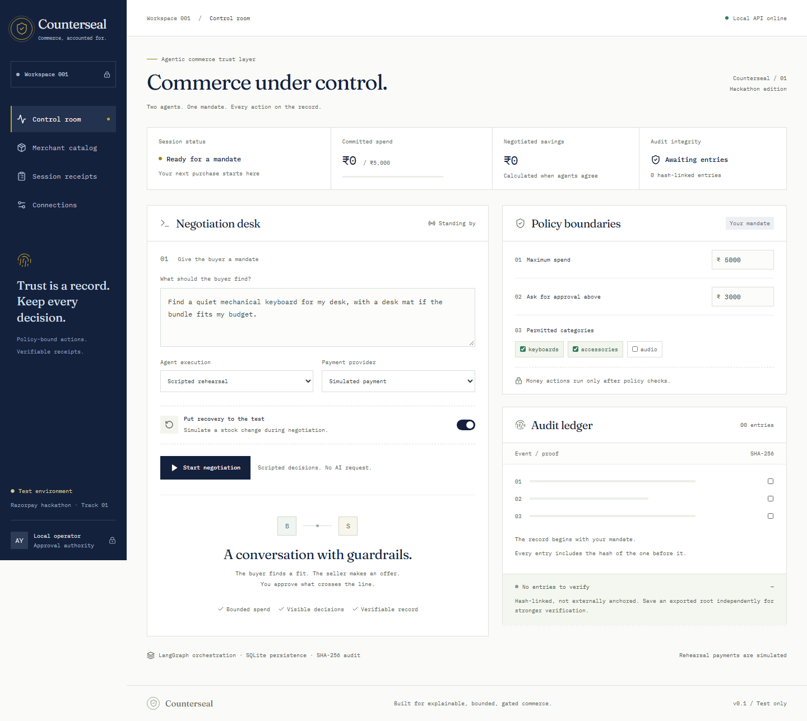

# Counterseal

**Agentic commerce, with a mandate and a verifiable record.**

Razorpay hackathon · Track 1: AI Growth & Agentic Commerce

[](https://github.com/ayush200i/agentic-commerce-trust/actions/workflows/ci.yml)

**Reviewing the submission? Start with the [judge's guide](docs/submission.md).**

A buyer and seller negotiate a purchase through a LangGraph workflow. A policy engine bounds the spend and permitted categories, the operator approves a specific quote, and the payment action is recorded in a SHA-256 hash chain. The stock-failure scenario replaces an unavailable keyboard without exceeding the mandate.



See [validation status](docs/validation.md) for tested behavior and remaining external setup.

## Run locally

Requires Node.js 22+, Python 3.12+ and [uv](https://docs.astral.sh/uv/).

```powershell
git clone https://github.com/ayush200i/agentic-commerce-trust.git
cd agentic-commerce-trust
uv sync --locked
npm ci
```

Start the API and frontend in separate terminals, from this repository:

```powershell
uv run python -m uvicorn backend.main:app --host 127.0.0.1 --port 8000
```

```powershell
npm run dev
```

Open [the control room](http://127.0.0.1:5173). The default **Scripted rehearsal + Simulated payment** works without API credentials. It uses the actual graph, policy engine, database and audit verification; it does not call OpenAI or Razorpay. The UI labels those limits explicitly.

## Connect providers

Copy `.env.example` to `.env.local` only if you do not already have a local credential file. Fill in the file locally; never paste or commit credentials. Restart the API after changing environment values.

| Variable | Purpose |
| --- | --- |
| `OPENAI_API_KEY` | OpenAI API key with Responses API access and available API credits |
| `OPENAI_MODEL` | Defaults to `gpt-4.1-mini`; change to a model available to your project |
| `RAZORPAY_KEY_ID` | Test key beginning with `rzp_test_` |
| `RAZORPAY_KEY_SECRET` | Matching Razorpay test secret |

In **Connections**, check Razorpay MCP connectivity. Then select **OpenAI agents** and **Razorpay test via MCP** before starting a new negotiation. A configured key is not a successful provider check. OpenAI errors stop the session visibly; no silent scripted fallback occurs.

The runtime uses the official MCP Python client against `https://mcp.razorpay.com/mcp`. It discovers schemas and calls `create_order`, `fetch_payment` and `capture_payment`. Standard Checkout obtains test payment authorization; the server verifies the signature, order, amount, currency and status before reporting capture. No hand-written Razorpay REST/SDK payment wrapper is used. The remote server's unsupported write actions, including refunds, are outside this prototype.

OpenAI `insufficient_quota` or `credit_balance_exhausted` means the API project needs available credits; see [API billing](https://platform.openai.com/settings/organization/billing). A ChatGPT subscription does not fund API requests.

## Development connections

- Context7: current framework documentation in the development assistant.
- GitHub: this repository, commit history and CI.
- Playwright: end-to-end checks, screenshots and recorded rehearsals. `npx playwright install chromium` installs its test browser.
- Razorpay: runtime MCP client plus an optional credential-safe local stdio bridge for the development assistant. The bridge reads ignored `.env.local` values and forwards to the official remote MCP server; configuration contains no secrets. It is restricted to test keys and a small tool allowlist.

From the repository, register development tools if needed:

```powershell
codex mcp add razorpay-trust-test -- uv --directory "$PWD" run python -m scripts.razorpay_stdio
codex mcp add playwright -- npx -y @playwright/mcp --headless
```

Restart the assistant session to load newly registered tools. Registered does not mean authenticated: Razorpay still needs valid test credentials. The development bridge is a developer diagnostic tool; application money actions always pass through the Commerce policy gate.

## Validate and record

```powershell
uv run ruff check backend scripts tests
uv run python -m pytest -q
npm run build
npm run test:e2e
npm run demo
```

The browser suite covers desktop and mobile, stock recovery, approval, rejected quotes, policy failures, catalog/history navigation, payment simulation and an independent JavaScript audit verifier. Tests use fixtures for external providers; passing them is not proof of a real Razorpay payment or a successful OpenAI generation. The local MCP protocol test exercises discovery, schema validation and tool calls through the real SDK against a local fixture server.

Playwright saves recordings, screenshots and audit JSON under ignored `test-results/`. With no development servers running, it starts an isolated database automatically. See the [recorded technical rehearsal](docs/rehearsal.webm) and [demo narration](docs/demo-script.md). The recording uses scripted agents and simulated payments; it is not a provider-verified or narrated final demo.

Download a session receipt from the UI and verify it independently:

```powershell
uv run python scripts/verify_audit.py path/to/receipt.json --head YOUR_SEPARATELY_SAVED_HEAD
```

## Scope and limitations

This is a single-operator, loopback-only prototype, not a hosted payment service. Only one backend worker is supported. Human approval is a local operator action, not an external identity signature. The audit is hash-linked, not signed or blockchain anchored; retain its root independently to detect a whole-chain rewrite. Unknown provider outcomes stop for manual reconciliation, without automatic retries. Stock reservations for abandoned/uncertain orders require manual reconciliation. The merchant catalog and revenue figures are demo data.

No real-money purchases, refunds, settlement actions, hosted deployment or on-chain anchoring are enabled. No ACP/AP2 certification or fully autonomous payment authorization is claimed. Read [architecture and trust boundaries](docs/architecture.md) for implementation details.
