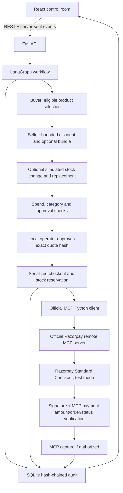

# Counterseal architecture

Counterseal is a local prototype of the Agentic Commerce Trust Layer from the Razorpay hackathon brief.
The merchant catalog is seeded demo data. It has no connection to real merchant inventory.

## Execution modes

- **Scripted rehearsal:** deterministic buyer and seller fixtures running through the actual LangGraph graph. It makes no OpenAI calls and is always labeled scripted.
- **OpenAI agents:** the buyer and seller use the Responses API with Pydantic structured output. The buyer chooses among eligible catalog items. The seller proposes a discount from a fixed set and an optional mat. Prices, categories, stock, arithmetic, approvals, tool names and payment arguments remain under server control.
- **Simulated payment:** local order and payment identifiers prefixed `sim_`. No Razorpay request or real money movement.
- **Razorpay test:** only `rzp_test_` credentials accepted. Orders, fetches and captures use the official remote MCP endpoint; Standard Checkout obtains the user's test payment authorization. This is not a fully autonomous wallet or AP2 mandate implementation.

Agent and payment mode are independent and frozen into each session. There is no silent fallback after a failed provider request. The UI surfaces safe summaries of quota/authentication/network errors.

## Trust boundaries

Money is integer paise. The session's policy is snapshotted at creation. Quote hashes bind the session, policy, item lines, total and payment mode. Human approval is bound to that hash. Both order creation and capture revalidate the quote, policy and audit chain. Double-clicks and repeated confirmations do not repeat a successful order/capture; in-process locks serialize monetary transitions.

SQLite stores catalog inventory, session state, transactions and audit events. Inventory reservation, the order-intent event and the session checkpoint commit atomically. Other events and their session checkpoints also commit together. Monetary operations run in one local worker. An interrupted order/capture is marked for reconciliation on restart and is never automatically retried. Reservations for uncertain or abandoned checkouts remain held for operator reconciliation; automatic expiry/cancellation is not implemented.

The browser sends a local-operator header for mutations; cross-origin browser writes are rejected. This prototype has no login or multi-user authorization. Run it bound to loopback with one worker. Deployment would require authenticated operators, durable distributed locks, webhook reconciliation, rate limits and a deployment-specific origin policy.

Checkout completion verifies HMAC-SHA256 over `order_id|payment_id` and independently fetches provider status via MCP. A mismatched order, amount, currency or payment identifier blocks capture. Uncertain provider outcomes remain in `reconciliation_required`; the order receipt/session ID is preserved for investigation. Requests and whitelisted response fields are auditable; contact, card and credential data are excluded from logs.

## Audit semantics

An entry contains sequence, session ID, timestamp, actor, action, decision summary, evidence and previous hash. SHA-256 hashes canonical UTF-8 JSON: sorted keys, compact separators, unescaped Unicode, excluding the `hash` field. This is a hash chain, not a digital signature. The UI does not display private model chain-of-thought; it displays decision summaries and application evidence.

Changing, reordering or removing an entry breaks verification against a previously trusted head. A hash chain alone cannot prove authenticity against an attacker who rewrites the entire database and its stored head. Save the exported head independently and pass it to `scripts/verify_audit.py --head`. No blockchain anchoring, external signature, ACP/AP2 conformance or revenue uplift study is claimed.

## Sources consulted

- [Razorpay official MCP server and supported tools](https://github.com/razorpay/razorpay-mcp-server)
- [Razorpay remote setup](https://razorpay.com/docs/mcp-server/remote/)
- [Official MCP Python SDK](https://github.com/modelcontextprotocol/python-sdk)
- [LangGraph](https://github.com/langchain-ai/langgraph)
- [OpenAI quickstart](https://developers.openai.com/api/docs/quickstart)
- [Playwright](https://playwright.dev/docs/intro)
